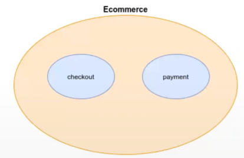
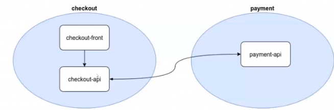
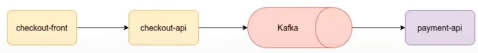

## Creation of an e-commerce solution with microservices in Java live coding at DIO (Digital Innovation One)

Project developed to use microservices in an e-commerce environment.
In this microservice architecture, integration between services is event 
oriented with Apache Kafka and compatibility between your communications 
is guaranteed with Schema Registry


## Requirements
  Docker, postgresql, and jdk must be installed.
  To the postgresql create the user: admin and password: admin, port: 5432 to the localhost (port: 5433 to docker).
  Then create the database with name checkout and payment.
  
---
## Project diagram

### Domain


### Architecture





## Technologies
    - Java
    - Spring Boot
    - Spring Cloud Stream (framework for building highly scalable event-driven microservices connected with shared messaging systems)
    - Schema Registry (to ensure compatibility between microservice communication)
    - Docker (used for the construction of infrastructure containers and their orchestration)
    - PostgreSQL
    - Apache ZooKeeper (manage all brokers in kafka)
    - Apache Kafka (distributed platform of messaging and streaming. Broker: instances of kafka)
    - Apache Avro (data serialization)
---

## How to run

  > running Project
  ```bash
   
    # Running web api checkout	
	
    In the terminal access the directory docker in checkout-api and 
    
    #to start
    docker-compose up --build -d 
    
    # to stop and destroy.
    docker-compose down 

    # to check the services
    docker ps 
	
    # Running web api payment	
    ecommerce-checkout-api and ecommerce-payment-api in your IDE. 
    
    # Open cart.html
    ecommerce-checkout-frontend/cart.html in your browser, fill in the fields and click buy.
	 
    Notes:
    -> Access http://localhost:8080/v1/checkout/ in the postman ou insomnia to make a request (POST) in JSON format. To this alter in the class CheckoutResource
       @ModelAttribute to @RequestBody.
    -> Schema Registry API: http://localhost:8081/subjects/streaming.ecommerce.checkout.created-value/versions/latest
	
    
  ```
---
